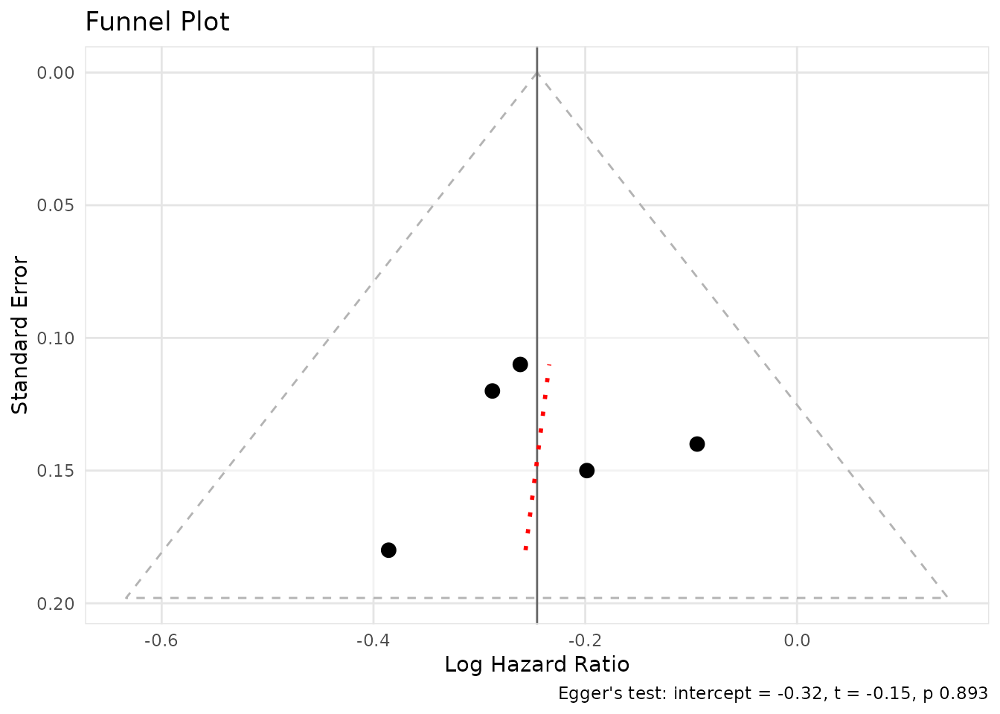

# Meta-Analysis and Network Meta-Analysis

``` r
library(pharmhand)
```

## Introduction

pharmhand provides comprehensive functions for meta-analysis and network
meta-analysis (NMA), supporting German HTA requirements (G-BA/IQWiG).

## Pairwise Meta-Analysis

### Basic Meta-Analysis

The
\[[`meta_analysis()`](https://sims1253.github.io/pharmhand/dev/reference/meta_analysis.md)\]
function performs fixed or random effects meta-analysis.

``` r
# Five studies with hazard ratios
yi <- log(c(0.75, 0.82, 0.68, 0.91, 0.77))
sei <- c(0.12, 0.15, 0.18, 0.14, 0.11)

result <- meta_analysis(
  yi = yi,
  sei = sei,
  study_labels = paste("Study", 1:5),
  effect_measure = "hr",
  model = "random",
  method = "REML",
  knapp_hartung = TRUE
)

result@estimate
#> [1] 0.7823178
result@ci
#> [1] 0.6840484 0.8947045
result@heterogeneity$I2
#> [1] 0
```

### Heterogeneity Assessment

The
\[[`calculate_heterogeneity()`](https://sims1253.github.io/pharmhand/dev/reference/calculate_heterogeneity.md)\]
function computes heterogeneity statistics including Q, I², and τ².

``` r
het <- calculate_heterogeneity(yi, sei, method = "REML")
het$Q
#> [1] 2.009819
het$I2
#> [1] 0
het$tau2
#> [1] 214637.8
het$interpretation
#> [1] "Low heterogeneity"
```

### Leave-One-Out Sensitivity Analysis

The
\[[`leave_one_out()`](https://sims1253.github.io/pharmhand/dev/reference/leave_one_out.md)\]
function performs leave-one-out sensitivity analysis to identify
influential studies.

``` r
loo <- leave_one_out(result)
loo$results[, c("excluded_study", "estimate_display", "I2")]
#>   excluded_study estimate_display I2
#> 1        Study 1        0.7906126  0
#> 2        Study 2        0.7731710  0
#> 3        Study 3        0.8102179  0
#> 4        Study 4        0.7533013  0
#> 5        Study 5        0.7854280  0
loo$influential_studies
#> [1] "Study 3" "Study 4"
```

### Forest Plot

The
\[[`create_meta_forest_plot()`](https://sims1253.github.io/pharmhand/dev/reference/create_meta_forest_plot.md)\]
function creates forest plots for visualizing meta-analysis results.

``` r
plot <- create_meta_forest_plot(result, title = "Treatment Effect (HR)")
plot@plot
#> Warning in ggplot2::scale_x_log10(limits = xlim): log-10
#> transformation introduced infinite values.
#> `height` was translated to `width`.
```


### Funnel Plot and Publication Bias

The
\[[`create_funnel_plot()`](https://sims1253.github.io/pharmhand/dev/reference/create_funnel_plot.md)\]
function creates funnel plots to assess publication bias.

``` r
funnel <- create_funnel_plot(result, title = "Funnel Plot")
funnel@plot
```



The
\[[`eggers_test()`](https://sims1253.github.io/pharmhand/dev/reference/eggers_test.md)\]
function performs Egger’s test for funnel plot asymmetry.

``` r
egger <- eggers_test(yi = yi, sei = sei)
egger$p_value
#> [1] 0.8929091
egger$interpretation
#> [1] "No significant asymmetry detected (p >= 0.10)"
```

### Trim-and-Fill

The
\[[`trim_and_fill()`](https://sims1253.github.io/pharmhand/dev/reference/trim_and_fill.md)\]
function performs trim-and-fill analysis to adjust for publication bias.

``` r
tf <- trim_and_fill(result)
tf$n_imputed
#> [1] 0
tf$interpretation
#> [1] "No missing studies detected"
```

## Indirect Comparison

The
\[[`indirect_comparison()`](https://sims1253.github.io/pharmhand/dev/reference/indirect_comparison.md)\]
function performs indirect comparisons using the Bucher method.

``` r
# Bucher method: A vs B via common comparator C
indirect <- indirect_comparison(
  effect_ab = log(0.75),  # A vs C
  se_ab = 0.12,
  effect_bc = log(0.85),  # B vs C
  se_bc = 0.10,
  effect_measure = "hr",
  label_a = "Drug A",
  label_b = "Placebo",
  label_c = "Drug B"
)
indirect@estimate
#> [1] 0.8823529
indirect@ci
#> [1] 0.6496514 1.1984068
```

## Network Meta-Analysis

The
\[[`network_meta()`](https://sims1253.github.io/pharmhand/dev/reference/network_meta.md)\]
function performs network meta-analysis for multiple treatments.

### Basic NMA

``` r
nma_data <- data.frame(
  study = c("S1", "S2", "S3", "S4"),
  treat1 = c("A", "B", "A", "B"),
  treat2 = c("B", "C", "C", "D"),
  effect = log(c(0.75, 0.90, 0.80, 0.85)),
  se = c(0.12, 0.15, 0.18, 0.14)
)

nma <- network_meta(nma_data, effect_measure = "hr")
nma@comparisons
#> # A tibble: 4 × 9
#>   treatment vs    estimate ci_lower ci_upper    se n_studies evidence   rank
#>   <chr>     <chr>    <dbl>    <dbl>    <dbl> <dbl>     <int> <chr>     <dbl>
#> 1 A         A        1        1        1     0            NA reference    NA
#> 2 B         A        0.75     0.593    0.949 0.12          1 direct        2
#> 3 C         A        0.8      0.562    1.14  0.18          1 direct        3
#> 4 D         A        0.638    0.444    0.915 0.184         2 indirect      1
```

### Network Geometry Plot

The
\[[`create_network_plot()`](https://sims1253.github.io/pharmhand/dev/reference/create_network_plot.md)\]
function creates network geometry plots to visualize treatment networks.

``` r
net_plot <- create_network_plot(nma, title = "Treatment Network")
net_plot@plot
```


### SUCRA Rankings

The
\[[`calculate_sucra()`](https://sims1253.github.io/pharmhand/dev/reference/calculate_sucra.md)\]
function calculates SUCRA (Surface Under the Cumulative Ranking) scores
for treatment rankings.

``` r
sucra <- calculate_sucra(nma)
sucra$ranking
#>   treatment mean_rank    sucra prob_best prob_worst final_rank
#> D         D     1.614 79.53333     0.585      0.027          1
#> B         B     2.141 61.96667     0.216      0.020          2
#> C         C     2.422 52.60000     0.199      0.122          3
#> A         A     3.823  5.90000     0.000      0.831          4
sucra$interpretation
#> [1] "Treatment ranking by lower is better (SUCRA, %). Best: D (79.5%), Worst: A (5.9%)"
```

### League Table

The
\[[`create_league_table()`](https://sims1253.github.io/pharmhand/dev/reference/create_league_table.md)\]
function creates league tables showing pairwise treatment comparisons.

``` r
league <- create_league_table(nma)
league@data
#> # A tibble: 4 × 5
#>   Treatment A                  B                  C                 D           
#>   <chr>     <chr>              <chr>              <chr>             <chr>       
#> 1 A         A                  1.33 (1.05, 1.69)* 1.25 (0.88, 1.78) 1.57 (1.09,…
#> 2 B         0.75 (0.59, 0.95)* B                  0.94 (0.61, 1.43) 1.18 (0.76,…
#> 3 C         0.80 (0.56, 1.14)  1.07 (0.70, 1.63)  C                 1.25 (0.76,…
#> 4 D         0.64 (0.44, 0.92)* 0.85 (0.55, 1.31)  0.80 (0.48, 1.32) D
```

### Transitivity Assessment

The
\[[`assess_transitivity()`](https://sims1253.github.io/pharmhand/dev/reference/assess_transitivity.md)\]
function assesses the transitivity assumption in network meta-analysis.

``` r
chars <- data.frame(
  study_id = c("S1", "S1", "S2", "S2", "S3", "S3", "S4", "S4"),
  treatment = c("A", "B", "B", "C", "A", "C", "B", "D"),
  mean_age = c(55, 55, 58, 58, 52, 52, 60, 60),
  pct_male = c(60, 60, 65, 65, 55, 55, 70, 70)
)

transit <- assess_transitivity(
  study_characteristics = chars,
  char_vars = c("mean_age", "pct_male"),
  continuous_vars = c("mean_age", "pct_male")
)
transit$overall_assessment
#> [1] "Transitivity assumption appears reasonable"
```

## Consistency Assessment

A key assumption in network meta-analysis is consistency between direct
and indirect evidence. pharmhand provides tools to assess this
assumption.

### Comparing Direct and Indirect Evidence

When both direct (head-to-head) and indirect evidence exist for a
comparison, we can test whether they agree:

``` r
# Suppose we have direct evidence for A vs B from a head-to-head trial
direct <- list(
  estimate = log(0.78),
  se = 0.14
)

# And indirect evidence via common comparator C
indirect <- indirect_comparison(
  effect_ab = log(0.75),  # A vs C
  se_ab = 0.12,
  effect_bc = log(0.96),  # B vs C
  se_bc = 0.11,
  effect_measure = "hr",
  label_a = "A",
  label_b = "C",
  label_c = "B"
)
```

\[[`compare_direct_indirect()`](https://sims1253.github.io/pharmhand/dev/reference/compare_direct_indirect.md)\]
compares direct and indirect evidence for consistency.

``` r
# Compare direct and indirect evidence
consistency <- compare_direct_indirect(
  direct_result = direct,
  indirect_result = indirect,
  effect_measure = "hr"
)

consistency$direct_estimate
#> [1] 0.78
consistency$indirect_estimate
#> [1] 0.78125
consistency$inconsistency_p
#> NULL
consistency$is_consistent
#> NULL
```

A non-significant p-value (p \> 0.05) suggests the direct and indirect
evidence are consistent, supporting the validity of the indirect
comparison.

### Node-Splitting Analysis

The
\[[`node_splitting()`](https://sims1253.github.io/pharmhand/dev/reference/node_splitting.md)\]
function performs node-splitting analysis to assess inconsistency in
network meta-analysis.

For network meta-analyses, node-splitting separates direct and indirect
evidence for each comparison to identify potential inconsistencies:

``` r
# Node-splitting analysis on our NMA
ns <- node_splitting(nma)
ns$results
#> # A tibble: 3 × 17
#>   comparison reference direct_estimate direct_se direct_ci_lower direct_ci_upper
#>   <chr>      <chr>               <dbl>     <dbl>           <dbl>           <dbl>
#> 1 A vs B     A                    0.75      0.12           0.593           0.949
#> 2 B vs C     A                    0.9       0.15           0.671           1.21 
#> 3 A vs C     A                    0.8       0.18           0.562           1.14 
#> # ℹ 11 more variables: n_direct <int>, indirect_estimate <dbl>,
#> #   indirect_se <dbl>, indirect_ci_lower <dbl>, indirect_ci_upper <dbl>,
#> #   n_indirect <int>, bridge <chr>, inconsistency_z <dbl>,
#> #   inconsistency_p <dbl>, model <chr>, conf_level <dbl>
ns$note
#> [1] "Full node-splitting requires re-analysis excluding direct evidence. Results shown are simplified."
```

Node-splitting helps identify specific comparisons where direct and
indirect evidence may disagree, which could indicate violations of the
transitivity assumption.

## Bayesian Meta-Analysis

For researchers preferring Bayesian inference, pharmhand provides an
interface to Bayesian meta-analysis using the brms package via the
\[[`bayesian_meta_analysis()`](https://sims1253.github.io/pharmhand/dev/reference/bayesian_meta_analysis.md)\]
function. This allows specification of informative priors and provides
full posterior distributions.

### Basic Bayesian Meta-Analysis

``` r
# Bayesian random-effects meta-analysis
# Requires: install.packages("brms")
bayes_result <- bayesian_meta_analysis(
  yi = yi,
  sei = sei,
  study_labels = paste("Study", 1:5),
  effect_measure = "hr",
  prior_mu = list(mean = 0, sd = 10),
  prior_tau = list(type = "half_cauchy", scale = 0.5),
  chains = 4,
  iter = 4000,
  adapt_delta = 0.95,
  max_treedepth = 12,
  seed = 12345
)

# Posterior summary statistics
bayes_result$posterior_mean      # Mean of posterior distribution
bayes_result$posterior_median    # Median of posterior distribution
bayes_result$ci_95               # 95% credible interval
bayes_result$prob_benefit        # P(HR < 1)
bayes_result$prob_superior       # P(HR < 0.9)
```

### Convergence Diagnostics

The
\[[`bayesian_meta_analysis()`](https://sims1253.github.io/pharmhand/dev/reference/bayesian_meta_analysis.md)\]
function now automatically reports convergence diagnostics to ensure
reliable results:

``` r
# Access convergence diagnostics
bayes_result$convergence_diagnostics

# Check individual metrics
bayes_result$convergence_diagnostics$max_rhat      # Should be <= 1.01
bayes_result$convergence_diagnostics$min_bulk_ess # Should be >= 400
bayes_result$convergence_diagnostics$min_tail_ess # Should be >= 400
bayes_result$convergence_diagnostics$divergent_transitions # Should be 0
```

Warnings are automatically issued when convergence issues are detected.
To improve convergence:

- Increase `adapt_delta` parameter (try 0.99 or 0.999)
- Increase `iter` for more samples
- Use more informative priors

### Predictive Checks

#### Posterior Predictive Checks

Assess model fit to the observed data:

``` r
# Enable posterior predictive checks
bayes_result <- bayesian_meta_analysis(
  yi = yi,
  sei = sei,
  effect_measure = "hr",
  posterior_predictive = TRUE,
  pp_check_type = "dens_overlay",
  pp_ndraws = 100
)

# View posterior predictive plot
bayes_result$pp_check_plot

# Check Bayesian p-value (should be around 0.5 for good fit)
bayes_result$posterior_predictive$bayes_p_value
```

#### Prior Predictive Checks

Evaluate prior reasonableness before seeing data:

``` r
# Fit with prior-only
bayes_result <- bayesian_meta_analysis(
  yi = yi,
  sei = sei,
  effect_measure = "hr",
  prior_predictive = TRUE
)

# View prior distribution
bayes_result$prior_predictive$summary
```

### Trace Plots

The
\[[`create_bayesian_trace_plots()`](https://sims1253.github.io/pharmhand/dev/reference/create_bayesian_trace_plots.md)\]
function visualizes MCMC chain convergence:

``` r
# Create combined trace plots
trace_plot <- create_bayesian_trace_plots(bayes_result)
print(trace_plot)

# Create individual parameter plots
trace_plots <- create_bayesian_trace_plots(
  bayes_result,
  parameters = c("b_Intercept", "sd_study__Intercept"),
  combine_plots = FALSE
)
print(trace_plots$b_Intercept)
```

Good convergence shows: - Well-mixed chains (no drift or stickiness) -
Similar distributions across chains - Rapid autocorrelation decay

### Prior Sensitivity Analysis

The
\[[`prior_sensitivity_analysis()`](https://sims1253.github.io/pharmhand/dev/reference/prior_sensitivity_analysis.md)\]
function tests how results change with different prior specifications:

``` r
# Run sensitivity analysis with default scenarios
sensitivity <- prior_sensitivity_analysis(
  yi = yi,
  sei = sei,
  effect_measure = "hr",
  chains = 2,
  iter = 2000
)

# Compare estimates across priors
sensitivity$comparison

# View robustness summary
sensitivity$sensitivity_summary$robustness_interpretation
```

Or specify custom prior scenarios:

``` r
custom_scenarios <- list(
  skeptical = list(
    prior_mu = list(mean = 0, sd = 0.5),
    prior_tau = list(type = "half_cauchy", scale = 0.3)
  ),
  optimistic = list(
    prior_mu = list(mean = -0.5, sd = 1),
    prior_tau = list(type = "half_cauchy", scale = 0.2)
  )
)

sensitivity <- prior_sensitivity_analysis(
  yi = yi,
  sei = sei,
  effect_measure = "hr",
  prior_scenarios = custom_scenarios
)
```

### IQWiG-Compliant Reporting

The
\[[`format_bayesian_result_iqwig()`](https://sims1253.github.io/pharmhand/dev/reference/format_bayesian_result_iqwig.md)\]
function formats Bayesian results for German HTA submissions:

``` r
# Format for IQWiG submission
formatted <- format_bayesian_result_iqwig(
  bayes_result,
  locale = "de"  # German locale
)

# View formatted components
formatted$estimate      # "0.790"
formatted$ci           # "[0.712; 0.877]"
formatted$probability   # "P(HR < 1) = 98.5%"
formatted$interpretation # Complete interpretation

# Export full formatted text
formatted$full_text
```

The
\[[`create_bayesian_forest_plot_iqwig()`](https://sims1253.github.io/pharmhand/dev/reference/create_bayesian_forest_plot_iqwig.md)\]
function creates IQWiG-compliant forest plots:

``` r
# Create IQWiG-formatted forest plot
study_data <- data.frame(
  yi = yi,
  sei = sei,
  study_labels = paste("Study", 1:5)
)

forest_iqwig <- create_bayesian_forest_plot_iqwig(
  bayes_result,
  study_data = study_data,
  locale = "de",
  title = "Behandlungseffekt (HR)"
)
print(forest_iqwig)
```

**Note:** Bayesian meta-analysis requires the `brms` package and a
working Stan installation. Install with `install.packages("brms")`. For
users without brms, the frequentist
\[[`meta_analysis()`](https://sims1253.github.io/pharmhand/dev/reference/meta_analysis.md)\]
function provides an alternative.

Advantages of the Bayesian approach include:

- Natural interpretation of credible intervals as probability statements
- Ability to incorporate prior knowledge
- Full posterior distributions for all parameters
- Better handling of small sample sizes

## Summary

pharmhand provides a complete toolkit for evidence synthesis:

| Function                                                                                                                             | Purpose                               |
|--------------------------------------------------------------------------------------------------------------------------------------|---------------------------------------|
| \[[`meta_analysis()`](https://sims1253.github.io/pharmhand/dev/reference/meta_analysis.md)\]                                         | Fixed/random-effects meta-analysis    |
| \[[`calculate_heterogeneity()`](https://sims1253.github.io/pharmhand/dev/reference/calculate_heterogeneity.md)\]                     | Q, I², τ² statistics                  |
| \[[`leave_one_out()`](https://sims1253.github.io/pharmhand/dev/reference/leave_one_out.md)\]                                         | Sensitivity analysis                  |
| \[[`create_meta_forest_plot()`](https://sims1253.github.io/pharmhand/dev/reference/create_meta_forest_plot.md)\]                     | Forest plot visualization             |
| \[[`create_funnel_plot()`](https://sims1253.github.io/pharmhand/dev/reference/create_funnel_plot.md)\]                               | Publication bias assessment           |
| \[[`eggers_test()`](https://sims1253.github.io/pharmhand/dev/reference/eggers_test.md)\]                                             | Funnel asymmetry test                 |
| \[[`trim_and_fill()`](https://sims1253.github.io/pharmhand/dev/reference/trim_and_fill.md)\]                                         | Bias adjustment                       |
| \[[`indirect_comparison()`](https://sims1253.github.io/pharmhand/dev/reference/indirect_comparison.md)\]                             | Bucher indirect comparison            |
| \[[`compare_direct_indirect()`](https://sims1253.github.io/pharmhand/dev/reference/compare_direct_indirect.md)\]                     | Test direct vs indirect consistency   |
| \[[`network_meta()`](https://sims1253.github.io/pharmhand/dev/reference/network_meta.md)\]                                           | Network meta-analysis                 |
| \[[`create_network_plot()`](https://sims1253.github.io/pharmhand/dev/reference/create_network_plot.md)\]                             | Network geometry                      |
| \[[`calculate_sucra()`](https://sims1253.github.io/pharmhand/dev/reference/calculate_sucra.md)\]                                     | Treatment rankings                    |
| \[[`create_league_table()`](https://sims1253.github.io/pharmhand/dev/reference/create_league_table.md)\]                             | Pairwise comparisons                  |
| \[[`assess_transitivity()`](https://sims1253.github.io/pharmhand/dev/reference/assess_transitivity.md)\]                             | Transitivity check                    |
| \[[`node_splitting()`](https://sims1253.github.io/pharmhand/dev/reference/node_splitting.md)\]                                       | NMA inconsistency testing             |
| \[[`bayesian_meta_analysis()`](https://sims1253.github.io/pharmhand/dev/reference/bayesian_meta_analysis.md)\]                       | Bayesian meta-analysis (via brms)     |
| \[[`create_bayesian_trace_plots()`](https://sims1253.github.io/pharmhand/dev/reference/create_bayesian_trace_plots.md)\]             | MCMC trace plot visualization         |
| \[[`prior_sensitivity_analysis()`](https://sims1253.github.io/pharmhand/dev/reference/prior_sensitivity_analysis.md)\]               | Prior sensitivity analysis            |
| \[[`format_bayesian_result_iqwig()`](https://sims1253.github.io/pharmhand/dev/reference/format_bayesian_result_iqwig.md)\]           | IQWiG formatting for Bayesian results |
| \[[`create_bayesian_forest_plot_iqwig()`](https://sims1253.github.io/pharmhand/dev/reference/create_bayesian_forest_plot_iqwig.md)\] | IQWiG-compliant forest plots          |
